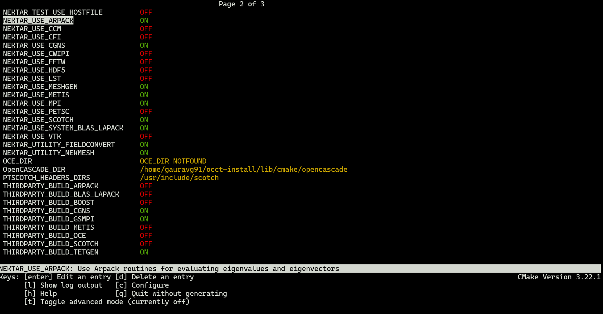

# Installation Guide for Nektar++ on HPC

## Installing Dependencies

`Boost`, `BLAS`, `LAPACK` and `Scotch` are mandatory libraries required by Nektar++ along with `GCC` and `CMAKE`. You can check if these are already available on your HPC or system using `module avail [library]`. If they are available you can load them using `module load [library/version]`. Otherwise, follow the steps to install them on your system.

Create a folder `nektar-depend` where all the dependencies will be downloaded, extracted and built. This keeps the home directory clean. All the libraries and Nektar++ will be installed in `$HOME/local`.

```sh
mkdir nektar-depend && cd nektar-depend
```

### Boost

- Download the source code and extract it
```sh
wget https://archives.boost.io/release/1.88.0/source/boost_1_88_0.tar.gz
tar -xvzf boost_1_88_0.tar.gz
cd boost_1_88_0
```
- Configure the installation
```sh
./bootstrap.sh --prefix=$HOME/local
```
- Install the code
```sh
.b2 install
```
- Export the path to installation directory. You can add to the `.bashrc` for ease of access in future.
```sh
export LD_LIBRARY_PATH=$HOME/local/lib:$LD_LIBRARY_PATH
export CPATH=$HOME/local/include:$CPATH
export LIBRARY_PATH=$HOME/local/lib:$LIBRARY_PATH
export PATH=$HOME/local/bin:$PATH
```

### BLAS and LAPACK

The OpenBLAS library provides support for both BLAS and LAPACK, so there is no need to install LAPACK separately.

- Download the source code and extract it
```sh
wget https://github.com/OpenMathLib/OpenBLAS/releases/download/v0.3.28/OpenBLAS-0.3.28.tar.gz
tar -xvzf OpenBLAS-0.3.28.tar.gz
cd OpenBLAS-0.3.28
```
- Install the code
```sh
make -j4
make install PREFIX=$HOME/local
```

### Scotch

- Download the source code and extract it
```sh
wget https://gitlab.inria.fr/scotch/scotch/-/archive/v7.0.7/scotch-v7.0.7.tar.gz
tar -xvzf scotch-v7.0.7.tar.gz
cd scotch-v7.0.7
```
- Create a build directory
```sh
mkdir build && cd build
```
- Configure the installation
```sh
cmake .. -DCMAKE_INSTALL_PREFIX=$HOME/local -DCMAKE_POSITION_INDEPENDENT_CODE=ON -DCMAKE_C_FLAGS="-fPIC" -DCMAKE_CXX_FLAGS="-fPIC"
```
- Install the code
```sh
make -j4 prefix=$HOME/local
make install
```

### ARPACK

ARPACK is the collection of Arnoldi methods used for Linear Stability analysis. If you are planning to use Nektar++ for linear stability analysis, then this library is a mandatory one.
It depends on the `BLAS` and `LAPACK` library, so make sure you have installed it and the path to binaries are added.

> [!NOTE]
> This library is mandatory for Linear Stability Solver of Nektar++. Make sure to enable the `NEKTAR_USE_ARPACK` option during configuration of Nektar++ installer.

- Download and extract the source code
```sh
wget https://github.com/opencollab/arpack-ng/archive/refs/tags/3.9.1.tar.gz
tar -xvzf 3.9.1.tar.gz
cd arpack-ng-3.9.1
```
- Create a build directory
```sh
mkdir build && cd build
```
- Configure the installation
```sh
cmake -DEXAMPLES=ON -DMPI=ON -DBUILD_SHARED_LIBS=ON -DCMAKE_INSTALL_PREFIX:PATH=$HOME/local ..
```
- Install the code
```sh
make
make install
```

### OpenCascade (OCCT)

OpenCascade library is required for mesh generation and optimization in Nektar++. The steps below are used to compile the OCCT library from source.

> [!NOTE]
> This library is NOT required for conversion of mesh to Nektar++ format. You may skip this step if you have disabled the `NEKTAR_USE_MESHGEN` option.

- Install the dependencies of OCCT library
```sh
sudo apt update && sudo apt install -y \
    build-essential cmake git \
    freeglut3-dev libx11-dev libxext-dev \
    libxt-dev libgl1-mesa-dev libglu1-mesa-dev \
    libfreetype6-dev libtbb-dev \
    libxmu-dev libxi-dev \
    libpng-dev libglfw3-dev \
    libeigen3-dev libfontconfig1-dev
```
- Download and extract the source code
```sh
wget https://github.com/Open-Cascade-SAS/OCCT/archive/refs/tags/V7_9_1.tar.gz
tar -xvzf V7_9_1.tar.gz && cd OCCT-7_9_1
```
- Create a build directory
```sh
mkdir build && cd build
```

- Configure the build using cmake.
```sh
cmake .. \
  -DCMAKE_INSTALL_PREFIX=$HOME/local
  -DBUILD_MODULE_Draw=OFF \
  -DBUILD_MODULE_ApplicationFramework=ON -DBUILD_MODULE_DataExchange=ON \
  -DBUILD_MODULE_ModelingData=ON -DBUILD_MODULE_ModelingAlgorithms=ON \
  -DBUILD_MODULE_Visualization=ON -DCMAKE_BUILD_TYPE=Release
```

- Install the library
```sh
make -j4 install
```

## Installing Nektar++
### Download and extact the source code

```sh
wget https://www.nektar.info/src/nektar%2B%2B-5.8.0.tar.gz && tar -xvzf nektar++-5.8.0.tar.gz
```

### Create the build directory

```sh
cd nektar-v5.8.0 && mkdir -p build && cd build
```

### Configure the installation
- Initialize the configuration (It enforces the location of dependency binaries, if the GUI version is not able to find them.)
```sh
cmake .. \
  -DCMAKE_PREFIX_PATH=$HOME/local \
  -DCMAKE_LIBRARY_PATH=$HOME/local/lib:$HOME/local/lib64 \
  -DCMAKE_INCLUDE_PATH=$HOME/local/include \
  -DCMAKE_INSTALL_PREFIX=$HOME/local/nektar \
  -DCMAKE_C_COMPILER=gcc \
  -DCMAKE_CXX_COMPILER=g++ \
  -DCMAKE_CXX_STANDARD=17 \
  -DCMAKE_CXX_FLAGS="-std=c++17" \
  -DMPI_C_COMPILER=mpicc \
  -DMPI_CXX_COMPILER=mpicxx \
  -DNEKTAR_USE_MPI=ON
```
- Modify the configuration by running `ccmake ../`
	- Press c to start the configuration.
	- Select the components of Nektar++ (prefixed with `NEKTAR_BUILD_`) you would like to build. Disabling solvers which you do not require will speed up the build process.
	- Select the optional libraries you would like to use (prefixed with `NEKTAR_USE_`) for additional functionality. Check the list of configuration options can be accessed [here](https://doc.nektar.info/userguide/latest/user-guidese3.html#x7-180001.3.5).
	- Press c to continue the configuration.
	- Press g to generate the make files.



### Compile the code

```sh
make -j4 install
```

### Add to path
After completion of installation, add the bin and lib64 folders present in the default installation folder `nektar-v5.8.0/build/dist` to PATH.

```sh
export PATH=$PATH:$HOME/local/nektar/bin
export LD_LIBRARY_PATH=$HOME/local/nektar/lib64:$LD_LIBRARY_PATH
```